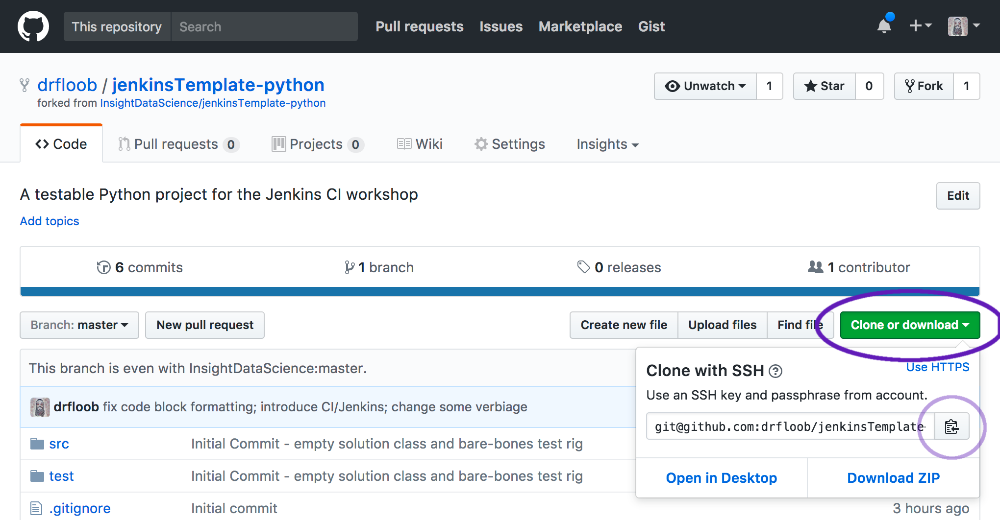

# jenkinsTemplate-python
A testable Python project for the Jenkins CI workshop @ Insight Data Engineering.

 * [Part 0: Getting Started](#part-0-getting-started)
 * [Part 1: Problem Statement](#part-1-problem-statement)
 * [Part 2: Implement and Test](#part-2-implement-and-test)
 * [Part 3: Jenkins](#part-3-jenkins-continuous-integration)
 * [Part 4: TDD](#part-4-tdd)

----

## Part 0: Getting Started

To begin, fork this repo on GitHub ...

<kbd></kbd>

... then clone it to your local machine by copying the clone link ...

<kbd></kbd>

... and using `git clone` at your shell / command line with the clone link you just copied. The command will look something like this:

```bash
git clone git@github.com:[MY_USER]/jenkinsTemplate-python.git
```


## Part 1: Problem Statement

Given an array of `2n` integers, your task is to group these integers into `n` pairs of integers, say `(a<sub>1</sub>, b<sub>1</sub>), (a<sub>2</sub>, b<sub>2</sub>), ..., (a<sub>n</sub>, b<sub>n</sub>)` which makes the sum of `min(a<sub>i</sub>, b<sub>i</sub>)` for all `i` from `1` to `n` as large as possible.

### Example

Input: [1,4,3,2]

Output: 4
Explanation: n is 2, and the maximum sum of pairs is 4.

### Notes

n is a positive integer, which is in the range of [1, 10000].
All the integers in the array will be in the range of [-10000, 10000].


## Part 2: Implement and Test

Your first job is to implement a working solution that passes the given test. To do so, modify the code in `src/arrayPartition1.py`.

Testing is performed by calling `./runTests.py` from your shell / command line.

If you've implemented a correct solution, the output should look like this:

```bash
$ ./runTests.py
.
----------------------------------------------------------------------
Ran 1 test in 0.000s

OK
```

When you're finished and your test passes, be sure to push your changes back up to GitHub. Here is a rough outline of how to do it:

 * `git status` will show you which files have changed or been added
 * `git add [FILENAME] ...` will mark specific files to be committed and sent back to github
 * `git commit` will commit your changes locally and allow you to describe what changed in your commit message
 * `git push` will send your local committed changes back to GitHub


## Part 3: Jenkins Continuous Integration

Now that you have a working solution, let's make sure that whenever you change your code and push it back to GitHub, it remains executable and that all of your tests still pass.

Jenkins is a popular Open Source tool for Continuous Integration and Continuous Delivery. Since we're not working with collaborators or deploying our code anywhere, we'll be using Jenkins for Continuous Testing alone.


## Part 4: TDD
