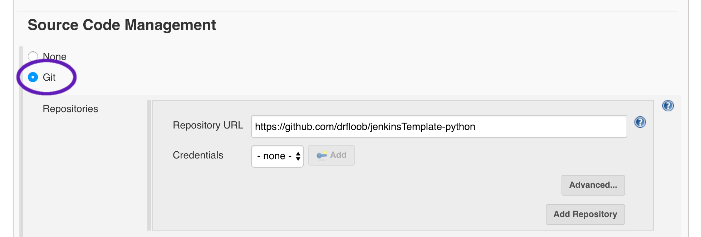
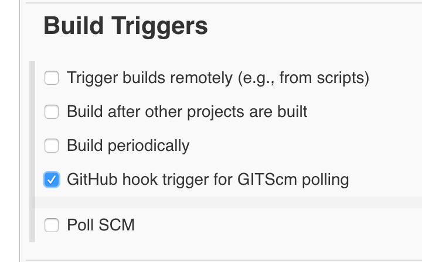
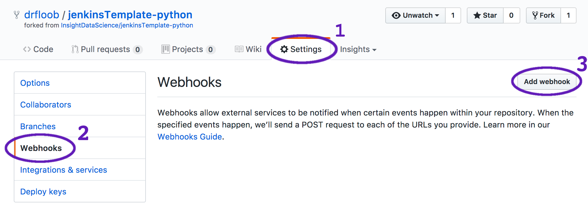
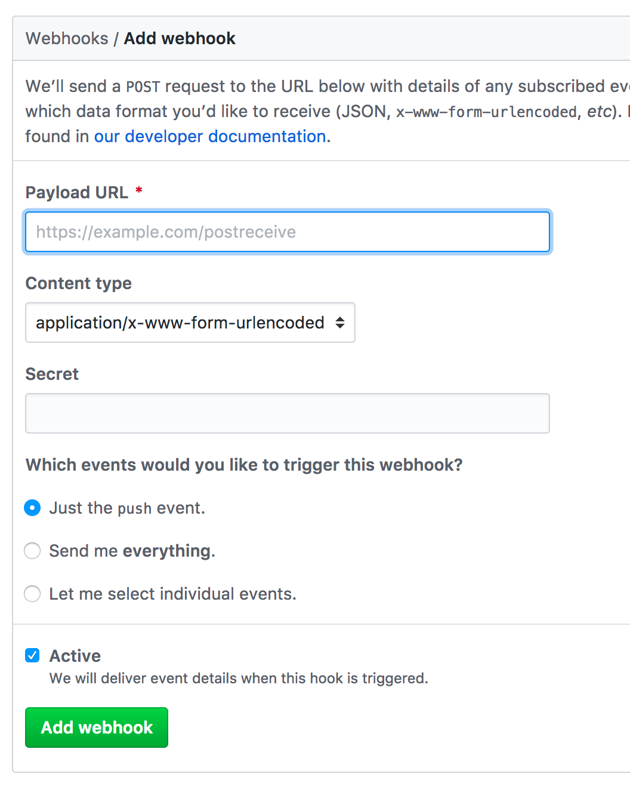
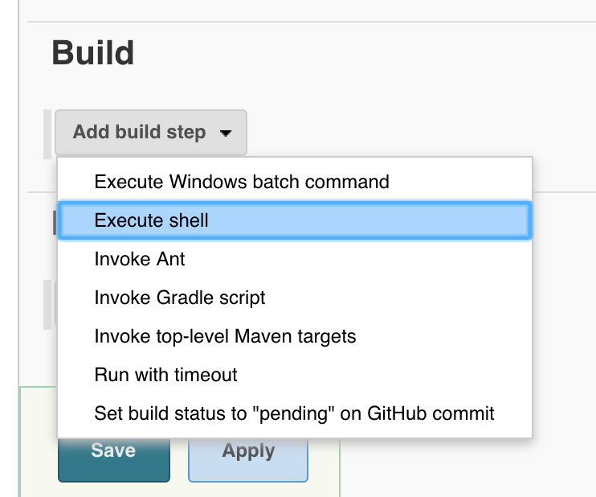
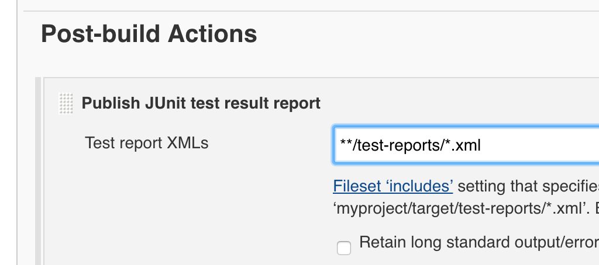

# jenkinsTemplate-python
A testable Python project for the Jenkins CI workshop @ Insight Data Engineering.

 * [Part 0: Getting Started](#part-0-getting-started)
 * [Part 1: Problem Statement](#part-1-problem-statement)
 * [Part 2: Implement and Test](#part-2-implement-and-test)
 * [Part 3: Jenkins](#part-3-jenkins-continuous-integration)
 * [Part 4: Test-Driven Development](#part-4-test-driven-development)

----

## Part 0: Getting Started

To begin, fork this repo on GitHub ...

<kbd></kbd>

... then clone it to your local machine by copying the clone link ...

<kbd></kbd>

Finally, use `git clone` at your shell / command line with the clone link you just copied. The command will look something like this:

```bash
git clone git@github.com:[MY_USER]/jenkinsTemplate-python.git
```


## Part 1: Problem Statement

Given an array of *2n* integers, your task is to group these integers into *n* pairs of integers, say *(a<sub>1</sub>, b<sub>1</sub>), (a<sub>2</sub>, b<sub>2</sub>), ..., (a<sub>n</sub>, b<sub>n</sub>)* which makes the sum of *min(a<sub>i</sub>, b<sub>i</sub>)* for all *i* from *1* to *n* as large as possible.

### Example

 * **Input:** [1,4,3,2]
 * **Output:** 4
 * **Explanation:** n is 2, and the maximum sum of pairs is 4.


### Notes

 * n is a positive integer, which is in the range of [1, 10000].
 * All the integers in the array will be in the range of [-10000, 10000].


## Part 2: Implement and Test

Your first job is to implement a working solution that passes the given test. To do so, modify the code in `src/arrayPartition1.py`.

Testing is performed by calling `./runTests.py` from your shell / command line.

If you've implemented a correct solution, the output should look like this:

```bash
$ ./runTests.py
.
----------------------------------------------------------------------
Ran 1 test in 0.000s

OK
```

When you're finished and your test passes, be sure to push your changes back up to GitHub. Here is a rough outline of how to do it:

 * `git status` will show you which files have changed or been added
 * `git add [FILENAME] ...` will mark specific files to be committed and sent back to github
 * `git commit` will commit your changes locally and allow you to describe what changed in your commit message
 * `git push` will send your locally committed changes back to GitHub


## Part 3: Jenkins Continuous Integration

Now that you have a working solution, let's make sure that whenever you change your code and push it back to GitHub, it remains executable and that all of your tests still pass.

Jenkins is a popular Open Source tool for Continuous Integration and Continuous Delivery. Since we're not working with collaborators or deploying our code to a server yet, we'll be using Jenkins for Continuous Testing alone.


 * As part of this workshop, you should have received an email with your username, password, and link to our internal Jenkins server. Use the link to log in to Jenkins. On the homepage, click the link on the left that says **New Item**

<kbd></kbd>


 * In the New Item configuration screen, set the name of the project to `[MY_USERNAME]-jenkinsTest`, then click the box underneath titled **Freestyle project**, and finally click **OK** at the bottom of the page.

<kbd></kbd>


 * On the project configuration screen, under **Source Code Management**, select the **Git** list item and enter the URL of your github repository page (Note: *not* the git clone URL). This tells Jenkins where it can get your code from (GitHub) and how to do it (using `git clone`).

<kbd></kbd>


 * To run tests whenever you push changes to GitHub, you'll need to set up Jenkins and GitHub together. For Jenkins, you'll need to navigate to the **Build Triggers** section and click the checkbox titled "GitHub hook trigger for GITScm polling".

<kbd></kbd>


 * On the GitHub side, you'll need to go into the project settings and add a new WebHook that points to your Jenkins server. The URL for the WebHook can be found in your email with your Jenkins credentials.

<kbd></kbd>
<kbd></kbd>


 * Now that Jenkins knows how and when to get a copy of your code, it needs to know how to test it. Further down the page, you'll find the **Build** section. Click on **Add build step**, then **Execute shell**.

<kbd></kbd>


 * In the command window that appears, type: `./runTests.py`.

 * We need to do a bit more work to teach Jenkins how to interpret our test results. Under **Post-Build Actions**, click on **Add post-build action**, and select **Publish JUnit test result report**. You'll want to enter `**/test-results/*.xml` in the *Test report XMLs* field, because that is where your python script prints out its test results.

<kbd></kbd>


 * Finally, click **Save** at the bottom.

If all went well, you'll have just set up push-based continuous testing with GitHub and Jenkins. Now let's test it out!

 * Make some small change to your repository,
 * commit it,
 * push it back up to GitHub, and
 * watch your Project Status page for a new build beginning on its own

You should very quickly see a new build in the queue, and within a few seconds, the test results should be available.


## Part 4: Test-Driven Development

Test-Driven Development (TDD) is a software development process wherein you write test cases for new software requirements, and only afterwards you improve the software to pass the tests. Let's practice.

What happens when you call `sln.ArrayPairSum(['herp', 'derp'])`? How should your program behave? It most likely throws an error, but maybe that isn't how you'd like your program to behave. Let's say you want to return 0 instead. To implement this using a TDD process:

 * create a new test in `test/test.py` that ensures ArrayPairSum returns 0 when it is called with a string array.

```python
    def test_str(self):
        assertEqual(self.sln.ArrayPairSum(["herp", "derp"]), 0)
```

 * run `./runTests.py` locally to show that this test (most likely) fails.
 * commit and push your new changes to GitHub, noting that this commit "Adds failing tests for returning 0 on string array".
 * ensure Jenkins picks up the changes, and that its tests fail in the same way
 * now fix the code such that the tests to pass. run `./runTests.py` locally to check.
 * when you're ready, commit and push your fix to GitHub, then check Jenkins to ensure your build succeeds.

